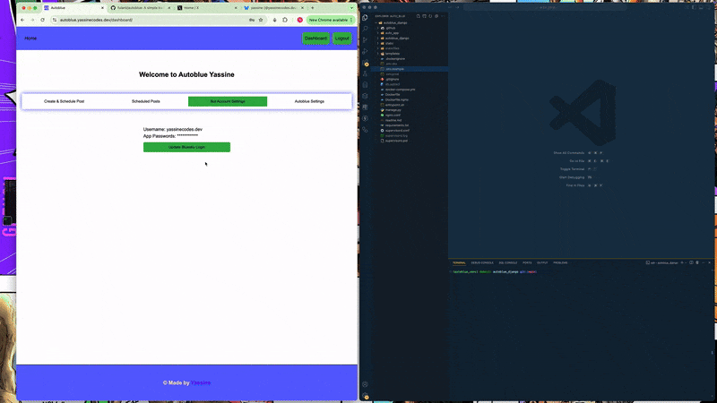

# Autoblue
Autoblue is an open-source web app for automating posts on [Bluesky](bsky.app), thanks to the [Bluesky](bsky.app) python api.

## Demo


## Curent Features
* User registration and login.
* Password change, (Autoblue) account deletion.
* Simple posts automation to Bluesky.
* Support for hashtags 
* Posts and scheduled posts history. 
* Schedule post canceletion. 

## Future Improvements
* Media uploads.
* Threaded posts creation.
* Add support for additional platforms beyond BlueSky.
* Build a richer frontend for better user experience.
* Add user analytics and performance metrics.

## Technologies Used
* Backend: Python, Django
* Frontend: HTML, CSS, JavaScript
* Database: PostgreSQL
* Containerization: Docker & Docker Compose
* Web Server: Nginx
* Task Queue: Celery & Redis
* Deployment: GitHub Actions for CI/CD, DigitalOcean Droplet

## Installation
For this app to run locally make sure you have `celery` and `redis` installed and setup. Use `auto_app.utils.generate_secret_key()` to generate a key using for encrypting your Bluesky username & password. And get a Django secret key using Django shell, add all those in   `.env.example`
1. Clone the repository:
```bash
git clone https://github.com/fulanii/autoblue.git
cd autoblue
```
2. Set up a virtual environment:
```bash
python -m venv venv
source venv/bin/activate  # On Windows: venv\Scripts\activate
```
3. Install dependencies:
```bash
pip install -r requirements.txt
```
4. Run the development server:
```bash
export DJANGO_ENV=development
celery -A auto_app.celery:app worker --loglevel=info
python manage.py migrate
python manage.py runserver
```
5. Set up postgres db, add your credentianls in .env.example
6. Access the app at http://127.0.0.1:8000/.

## Usage
Navigate to the homepage and log in. Use the interface to add your Bluesky logins, create posts or delete posts.